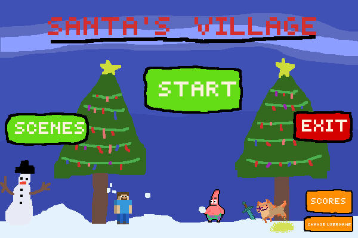
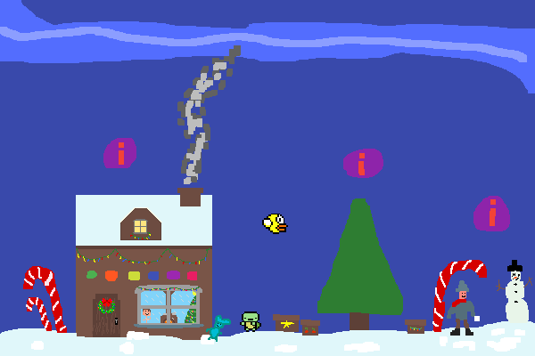
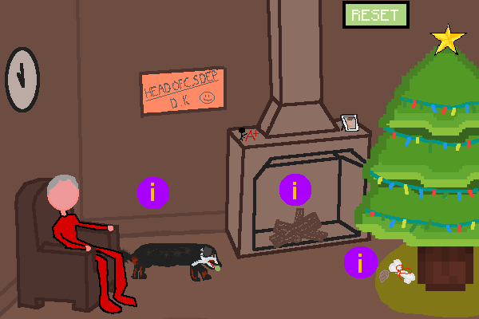
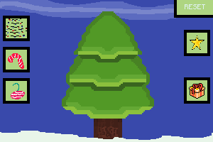
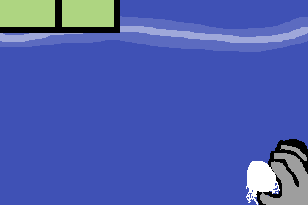
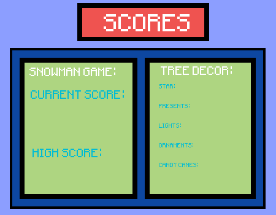
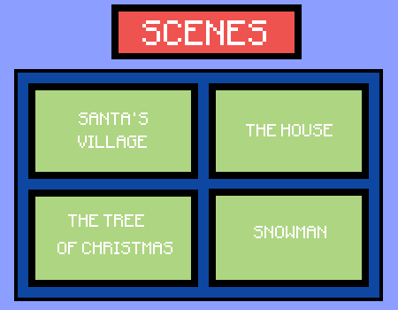

# Santa's Village
## Grade 10 Python / Processing Game

An interactive Christmas-themed game I built for my Grade 10 Computer Science final project in 2020 using **Python Mode for Processing**.

The player explores a small Christmas village that acts as the central hub, with different scenes and activities including house interactions, Christmas tree decorating, a snowman target minigame, score tracking, simple animations, music, and sound effects.

This repository preserves the original project as it was submitted, including the complete source code and original image/audio assets.

By: **Christopher Lee**

<p align="center">
  
</p>

---

## Play Santa's Village

A self-contained Windows build is available from the latest GitHub release:

**[Download the latest Windows build](https://github.com/Chris11011011/Santas-Village-GR10-Python-Project/releases/latest/download/Santas-Village-Windows-x64-Win11-ARM64.zip)**

To try the project as a playable demo:

1. Download the latest release ZIP.
2. Extract the **entire** ZIP.
3. Run `Santas_Village.exe`.
4. Keep the `jre`, `libraries`, and `runtime` folders beside the executable.

Processing, Python Mode, Java, and Minim do **not** need to be installed separately for the packaged build.

### Current build compatibility

| Platform | Compatibility |
| --- | --- |
| Windows 10/11 x64 (Intel/AMD) | Supported |
| Windows 11 ARM64 | Supported through Windows' built-in x64 emulation; tested on ARM64 |
| Native ARM64 | Not native; current release is an x64 build |
| Windows 32-bit | Not supported by this build |
| macOS | Not supported by this build |
| Linux | Not supported by this build |

> The executable is unsigned, so Windows SmartScreen may show an **Unknown publisher** warning on some systems.

---

## Project Overview

The project starts by asking for a player name before moving into the main menu and village. The village is the central scene, with separate areas for the house, Christmas tree, and snowman game.

`Username -> Main Menu -> Village -> House / Tree / Snowman -> Scores / Exit`

<p align="center">
  
</p>

Most of the experience is intentionally simple: click-based interactions, small animations, persistent scene state, music and sound effects, and a few short activities built into one Processing sketch.

---

## Scene Walkthrough

| House | Christmas Tree |
| --- | --- |
|  |  |
| Explore the room and trigger several small interactions and animated events. | Add lights, ornaments, candy canes, a star, and presents. The selected decorations are also reflected back in the village. |

| Snowman Game | Scores / Progress |
| --- | --- |
|  |  |
| A timed target game where the snowman and bonus snowball move around the screen. Different hit areas award different points. | Tracks the current/high score and shows which tree decorations have been activated. |

There is also a scene-selection screen, tips screen, username entry, animated sleigh movement, present dropping, loading/exit screens, and a collection of smaller sprites and effects layered over the main backgrounds.

---

## How the Project Works

The full game is built in one original Processing Python Mode sketch:

- **Original source:** [`Final_Coding_Project_Revised.pyde`](Final_Coding_Project_Revised/Final_Coding_Project_Revised.pyde)
- **Plain Python source copy:** [`Final_Coding_Project_Revised.py`](Final_Coding_Project_Revised/Final_Coding_Project_Revised.py)

The `.pyde` file is the original project file used by Processing. The `.py` copy is included only to make the same source easier to browse directly on GitHub.

At a high level:

- **`setup()`** loads the image, audio, font, scene, score, movement, and interaction state.
- **`draw()`** acts as the main game loop and renders the active scene based on `gameScreen`.
- **`gameScreen`** is the main state selector for the username, menu, village, house, tree, snowman, score, tips, scene-selection, and exit screens.
- **Clickable regions** are stored as coordinate boundaries and converted into a `validLocation` value in `mouseReleased()`.
- **Scene state** is stored with variables such as the tree-decoration flags, snowman score/ammo state, and house interaction flags.
- **Simple animation** is handled by continuously changing sprite coordinates and reversing movement when an object reaches a boundary.
- **Audio** is handled with the Processing **Minim** library, with separate music and sound effects for different scenes.

The code is representative of how I approached programming at the time: one large file, lots of shared state, and direct coordinate-based logic. I have intentionally kept that structure intact rather than refactoring the original project.

---

## A Few of the Main Systems

### Village hub

The village connects the major activities. Santa's sleigh moves across the screen, the player can drop presents with the keyboard, and changes made to the Christmas tree are reflected back into the village scene.

### Tree decorating

The tree scene uses a set of Boolean state variables to determine which decorations should be rendered. Clicking an option turns that decoration on, while reset clears the full tree state.

<p align="center">
  
  
  
</p>

### Snowman minigame

The snowman and bonus snowball move around the play area by updating their X/Y coordinates every frame and reversing direction at the edges. The player reloads a snowball, clicks different target regions for points, and tries to score as much as possible before the ticket counter reaches zero.

### House interactions

The house scene is more experimental and event-driven. Clickable regions trigger audio, sprite movement, object-state changes, and small scripted sequences layered on top of the background.

---

## Original Assets

The [`data/`](Final_Coding_Project_Revised/data) folder contains the original assets loaded by the sketch at runtime, including:

- full-screen backgrounds and menu art
- Santa, snowman, character, present, and effect sprites
- Christmas tree decorations and UI graphics
- sound effects and background music
- the original Processing font file

<p align="center">
  
</p>

---

## Repository Structure

```text
Santas-Village-GR10-Python-Project/
├── README.md
├── .github/
│   └── workflows/
│       └── build-portable-windows-test.yml
└── Final_Coding_Project_Revised/
    ├── Final_Coding_Project_Revised.pyde
    ├── Final_Coding_Project_Revised.py
    ├── sketch.properties
    └── data/
        ├── screen/background images
        ├── sprites and visual effects
        ├── UI assets
        ├── background music and sound effects
        └── BradleyHandITC-40.vlw
```

---

## Running the Original Project

This was built as a **Processing Python Mode** project rather than a normal standalone Python application.

To run the original source directly, you will need a compatible Processing installation with:

1. **Python Mode**
2. The **Minim** audio library

A working reconstruction has been verified with **Processing 3.5.4**, **Python Mode for Processing 3**, and **Minim 2.2.2**.

Then open:

`Final_Coding_Project_Revised/Final_Coding_Project_Revised.pyde`

and run the sketch from Processing.

The exact Processing version originally used for the project was not preserved, so the setup above is a verified compatibility reconstruction rather than a claim about the original environment.

---

## Development Notes

This project is not especially clean by current standards, and the original development process was not documented in much detail. Rather than reconstructing a history that was never recorded, this README focuses on the parts that can still be verified directly from the source and assets.

Looking back, the project is useful as a snapshot of an early attempt at combining **Python, Processing, screen/state management, coordinate-based UI, sprite movement, simple animation, scoring, persistent scene state, audio, and original visual assets** into one complete interactive program.

The original code and assets are preserved so the project can be understood in the form it was actually built.
